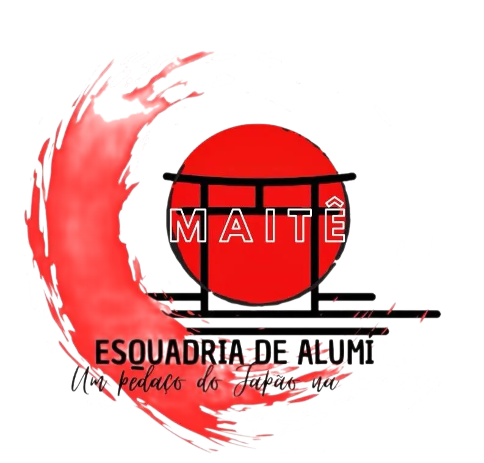

  

<h1 align="center">Site Institucional - Maite Esquadrias Personalizadas</h1>

---

### 🪟 Sobre o projeto

Este repositório contém a estrutura e o desenvolvimento do site da **Maite**, uma empresa especializada na fabricação e instalação de **esquadrias personalizadas** em alumínio, vidro e outros materiais de alta qualidade.

O objetivo do site é apresentar o portfólio de produtos, destacar os diferenciais da empresa e facilitar o contato com clientes interessados em soluções sob medida para obras residenciais e comerciais.

---

### 🌟 Funcionalidades implementadas

O site foi desenvolvido com foco em **design moderno**, **visualização de projetos** e **usabilidade**, incluindo:

- ✅ Página inicial com apresentação da marca e serviços
- ✅ Galeria de projetos com fotos de obras finalizadas
- ✅ Seção de produtos e materiais utilizados
- ✅ Formulário de orçamento rápido e formulário de contato
- ✅ Integração com WhatsApp para atendimento direto
- ✅ Mapa de localização e informações de contato
- ✅ Design responsivo e adaptado para celulares, tablets e desktops
- ✅ Otimização de imagens para melhor desempenho
- ✅ SEO básico para indexação em buscadores

---

### 🛠️ Tecnologias utilizadas

- **HTML5 / CSS3** — Estruturação e estilização do site
- **JavaScript** — Funcionalidades interativas
- **Google Maps API** — Integração de localização
- **Git & GitHub** — Controle de versão

---

### 📌 Observações

- O site foi desenvolvido em parceria com a equipe da **Maite**, levando em conta o público-alvo e a identidade visual da empresa.
- O layout é limpo, com foco na apresentação visual dos produtos e na facilidade de navegação.
- Futuramente, o site pode ser expandido com um catálogo digital ou área de cliente para acompanhamento de pedidos.

---

### 📚 Créditos

Agradecimentos à equipe da **Maite Esquadrias** pela confiança no projeto, pela atenção aos detalhes e pela busca constante por excelência no atendimento.

> “Detalhes que moldam seu espaço.” — *Maite Esquadrias*
